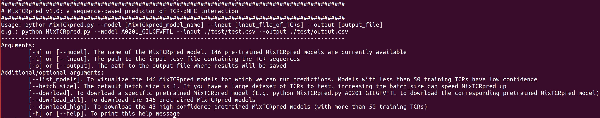

# MixTCRpred
MixTCRpred accurately predicts T-cell receptors (TCRs) recognizing several viral and cancer epitopes (peptides displayed on MHC molecules or pMHCs). Predictions are available for 146 pMHCs. Accurate predictions were achieved for 43 pMHCs that have more than 50 training TCRs. [Here](https://www.nature.com/articles/s41467-024-47461-8) the paper describing MixTCRpred predictive performance and applications.


## Run MixTCRpred with GoogleColab
You can run MixTCRpred within your web browser via Google Colab by clicking on [this link](https://colab.research.google.com/github/GfellerLab/MixTCRpred/blob/main/colab_MixTCRpred.ipynb).
This is a user-friendly and interactive way to analyze the specificity of your own TCR list.
For more extensive analysis or if you prefer to use MixTCRpred offline, it is recommended to install it on your local machine.

## Install MixTCRpred 

The code was tested with Python 3.9, 3.10 and 3.11

1. Clone the GitHub repository and move to the MixTCRpred directory
```bash
git clone https://github.com/GfellerLab/MixTCRpred 
cd MixTCRpred
```

2. (Recommended) Create a virtual environment 
```bash
# For Unix/Mac OS users
python -m venv MixTCRpred_venv  
source MixTCRpred_venv/bin/activate  # to activate the virtual environment (MixTCRpred_venv)
# Windows users please refer to https://docs.python.org/3/library/venv.html to create and activate a virtual environment. 
```

3. Install the required packages 
```bash
pip install --upgrade pip
pip install -r requirements.txt 
```

4. To test your installation, run the following command:
```bash
python MixTCRpred.py --help
```
  

or 

```bash
python MixTCRpred.py --list_models
```

which will list all available MixTCRpred models.


5. Finally run 

```bash
python MixTCRpred.py --model A0201_GILGFVFTL --input ./test/test.csv --output ./test/output.csv 
```

to predict which TCRs in the ./test/test.csv file are more likely to target the HLA-A\*02:01,GILGFVFTL epitope.

Before running the predictor, MixTCRpred also performs a quality control of the input data, attempting to correct incorrect V,J genes and extrapolating the CDR1 and CDR2 sequences. You can find the fixes and other information in the [output_file]_logfile file.

6. (Optional) To run MixTCRpred from anywhere on the computer, open the MixTCRpred.py file with your favourite editor and specify the full path to the pretrained models folder:
```bash
#change
path_pretrained_models = './pretrained_models'
#to 
path_pretrained_models = '/home/[...]/MixTCRpred/pretrained_models'
```

Next make an alias to the MixTCRpred.py file using the python version of the virtual enviroment:
```bash
# For Unix/Mac OS users
alias MixTCRpred='/home/[...]/MixTCRpred/MixTCRpred_venv/bin/python /home/[...]/MixTCRpred/MixTCRpred.py'
# you can make this alias permanent by adding it to your .bashrc file
```

## Usage

```bash
python MixTCRpred.py --model [MixTCRpred_model_name] --input [input_TCR_file] --output [output_file]
```

Three arguments are required:

``` --model``` or  ``` -m``` [MixTCRpred_model_name]. 
The format is HLA_PeptideSequence (e.g. A0201_GILGFVFTL).

```--input``` or ```-i``` [input_TCR_file].
csv file listing all the TCRs to test. See ./test/test.cvs for a reference input file. The columns order is not important.
CDR3 alpha and beta should not be longer than 20 amino acids.
Incomplete TCR entries are accepted, but the models will have lower predictive performance

``` --output``` or ```-o``` [output_file].
The name of the output file. It contains two extra columns than the input file: the MixTCRpred binding score and the %rank.


Additional and optional arguments are:  

```--list_models```. To list the 146 MixTCRpred models for which we can currently run predictions. Models with less than 50 training TCRs have low confidence  

```--batch_size```. The default batch size for testing is 1. If you have a large dataset of TCRs to test, increasing the batch_size can speed MixTCRpred up  

```--download model_name```. To download a specific pretrained MixTCRpred model  

```--download_all```. To download the 146 pretrained MixTCRpred models  

```--download_high```. To download the 43 high-confidence pretrained MixTCRpred models 

## Download MixTCRpred pretrained models

In the GitHub repository we include trhee MixTCRpred models (A0201_GILGFVFT and A0201_ELAGIGILTV, A0201_SLLWITQC_phage_display) as examples.
You can download the pretrained MixTCRpred models from our [Zenodo dataset](https://doi.org/10.5281/zenodo.7930623)

To download a specific pretrained model (e.g. A0201_NLVPMVATV) run:
```bash
python MixTCRpred.py --download A0201_NLVPMVATV 
```

To download all the 146 pretrained MixTCRpred models run:
```bash
python MixTCRpred.py --download_all
```

To download the high-confidence 43 models (more than 50 training TCRs) run:
```bash
python MixTCRpred.py --download_high
```

### Usage for A0201_SLLMWITQC_phage_display

A phage display screening was used to generate MixTCRpred models for the NY-ESO-1<sub>157-165</sub> epitope (A0201_SLLMWITQC). The MixTCRpred model name is A0201_SLLMWITQC_phage_display. 
Only TCR with TRBV6-5, TRBJ2-2, starting with "CASS" and ending with "GELFF" in the CDR3 beta are accepted as inputs, as those regions were not modified during the phage display experiment.
The A0201_SLLMWITQC_phage_display MixTCRpred model can not make reliable predictions for TCRs with other V,J genes or different N-, C- terminal.

To utilize the corresponding MixTCRmodel, simply execute the following command.

```bash
python MixTCRpred.py --model A0201_SLLMWITQC_phage_display --input [input_TCR_file] --output [output_file]
```

Please refer to the specific license (LICENCE_A0201_SLLMWITQC_phage_display.md) in order to use this MixTCRpred model.


## Contact information

For scientific questions, please contact [Giancarlo Croce](mailto:giancarlo.croce@unil.ch?subject=[GitHub]%20MixTCRpred%20) or [David Gfeller](mailto:david.gfeller@unil.ch?subject=[GitHub]%20MixTCRpred%20)

For license-related questions, please contact [Nadette Bulgin](mailto:nbulgin@lcr.org?subject=[GitHub]%20MixTCRpred%20).

## Acknowledgments

This project received funding from the European Union's Horizon 2020 research and innovation programme under the Marie Skłodowska-Curie grant agreement, No. 101027973, [MT-PoINT project](https://cordis.europa.eu/project/id/101027973)
